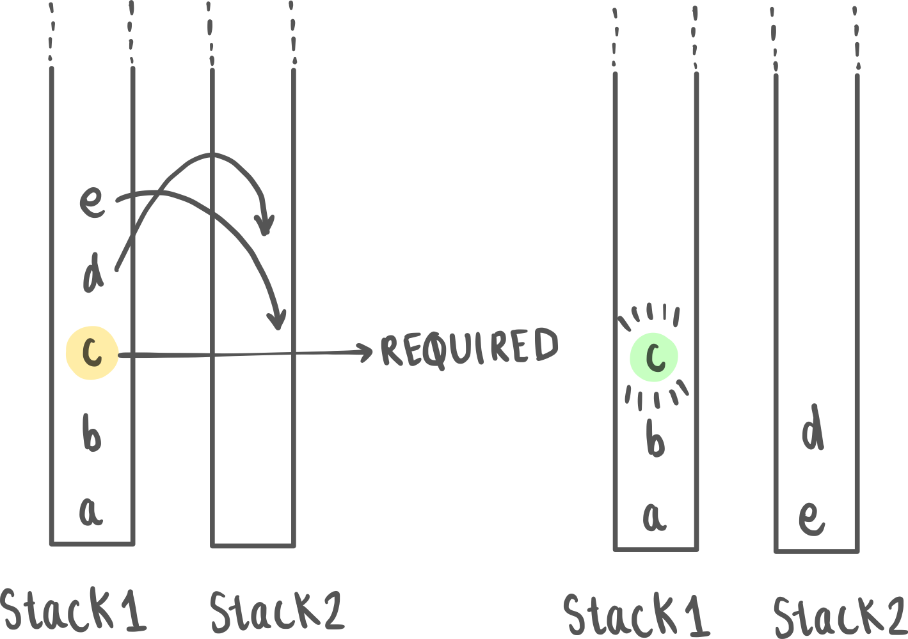

# Deterministic Turing Machines

# Prettest

**1. Which of the following is the primary memory structure of a Pushdown Automaton (PDA)?**

a. Infinite tape

b. Finite control

c. Queue

d. Stack

**Ans:** d

2**. Which computational device can recognize a larger class of languages?**

a. Finite Automaton

b. Pushdown Automaton

c. Turing Machine

d. Both PDA and TM recognize the same class of languages.

**Ans:** c 

3**. What is the primary difference between a finite automaton and a Turing machine?**

a. A Turing machine has multiple tapes.

b. A Turing machine has a read/write head and can modify its tape.

c. A finite automaton has an infinite tape.

d. A Turing machine cannot change states.

**Ans:** b

# Introduction

For a quick recap on Pushdown Automata, think of it as a simplified version of a computer that has a single data structure known as a **stack** (so you can only read or write at the top).

When you feed an input string into a PDA, it reads the symbols one by one and decides what to do based on its current state and the symbol it's reading. The stack becomes a crucial tool for the PDA, allowing it to keep track of information it has encountered as it processes the input. This makes PDAs particularly good at recognizing languages that require "matching" elements, like parentheses or nested structures. In fact, you might notice that even in some Data Structures and Algorithms courses, you may encounter parentheses/matching/largest histogram problems in the context of stacks. This applies to any problem wherein you can get enough information just by looking at the top. **What if we wanted to have access to more information?** 

In fact, through this section, we also gradually move away from automata, and languages, and into the domain of computability. 

# How to make the Pushdown automata more powerful?

Before you read on, try thinking about this: Instead of one stack, you’ve now been given 2 stacks. With one stack you could only access the topmost element. With 2 stacks, you can effectively access any middle element. How much of a difference does it make? 

Turns out, this increases our computational power so much that the resulting automata are turing complete! (More on this later) : Such a system can solve all problems that our modern computers can (in theory) Why is a queue so much much more powerful?

For example, When designing a Pushdown Automaton (PDA) to recognize languages like  $(a^nb^nc^n)$, you'll encounter difficulties in ensuring that the counts of $(a), (b),$ and $(c)$ are all the same. While you can create a PDA that checks if the symbol $(a)$ appears $(n)$ times by using its stack, the challenge arises from the lack of "context" between the different alphabet symbols and their respective counts. 

However, if you use a queue instead (or two stacks), you will be able to solve this problem. In fact, you’ll be able to solve *any* solvable problem. More explicitly put, If you can describe a step-by-step algorithm for solving a problem, a Turing machine can simulate that algorithm and execute those steps, symbol by symbol. (This is the church turing hypothesis)

<aside>
 Try ‘pouring’ the elements from one stack into the other to reach the accept state. When you try to access a middle element, you won’t lose memory of the elements which were above it.

</aside>

# Church Turing Hypothesis

Mathematician Alan Turing devised the Turing machine, a conceptual device with an infinite tape and a finite set of states, capable of performing a wide range of computations. Around the same time, independently, Alonzo Church introduced the lambda calculus, a system of formal logic that can capture the essence of computation through function application and abstraction. 

Despite the apparent differences between these models, they found a remarkable equivalence: Any calculation that can be performed using Church's lambda calculus can also be executed by the Turing machine, and vice versa.

This implies that when one speaks of 'effective computation,' it can be achieved through various means, be it lambda calculus, a Turing machine, or any equivalent formalism that one might conceive. The Church-Turing Hypothesis, in its simplest form, posits that any algorithmic process, no matter how complex, can be computed by a machine if it can be computed at all.

<aside>
 "Effective computation" refers to the process of performing calculations or solving problems using a well-defined, systematic, and algorithmic approach.

</aside>

# The Turing Machine

Turing machines are universal computational devices. They can simulate the operation of any algorithm, making them a formal representation of what we mean by "computation." The computation proceeds until the machine reaches a halting state, at which point it produces an output.

## Formal Definition

A Turing machine (TM) can be formally defined as a 7-tuple $(Q, Σ, Γ, δ, q0, q_{accept}, q_{reject})$ - You may have come across similar notation in the previous chapters.

1. $**Q$:** This is a finite set of states. Each state represents a unique configuration of the machine during its computation.
2. $**Σ$:** This represents the input alphabet, which is a finite set of symbols that can appear on the input **tape**.
3. $**Γ$:** This represents the tape alphabet, which is also a finite set of symbols. The tape alphabet includes Σ as a subset, and it may also contain additional symbols used for internal purposes.
4. $δ$: This is the transition function, which maps the current state, the symbol read from the tape, to the next state, the symbol to be written on the tape (which can be the same as the read symbol), and the direction in which the tape head should move (left or right). In formal notation, $δ: Q × Γ → Q × Γ × {L, R}$, where $×$ represents the Cartesian product.
5. $**q_0$:** This is the initial state. It indicates the state in which the machine starts its computation.
6. $**q_{accept}$:** This is the set of accepting states (or final states), which is a subset of Q. When the machine enters an accepting state, it signifies that the input has been accepted.
7. $q_{reject}$: The reject state(s), such that $q_{accept}$ and $q_{reject}$ are mutually exclusive.

The read-write head isn’t explicitly part of the formal definition, however, it would necessary to perform operations on the machine, as it’s what would retrieve the contents on the tape.

## Operations on a Turing machine

- It starts in the initial state $q_0$ with the tape head positioned at the leftmost cell of the input.
- It reads the symbol from the current tape cell.
- Based on the current state and the symbol read, it uses the transition function δ to determine the next state, the symbol to write on the tape, and the direction in which to move the tape head.
- This process continues iteratively until the machine enters an accepting or rejecting state. If it enters an accepting state, the input is accepted; if it enters a rejecting state or gets stuck in an infinite loop, the input is rejected.

## Deterministic Turing Machines

When we say “turing machine” we’re talking about a deterministic turing machine. In a DTM, for any given combination of current state and symbol being read from the tape, there is only one possible action or transition to the next state. 

1. **Universality:** DTMs are Turing-complete, simulating any Turing machine, including non-deterministic ones. They're a foundational model of computation.
2. **Language Recognition:** DTMs can recognize various formal languages, from regular to recursively enumerable, making them versatile.
3. **Algorithm Execution:** DTMs can execute algorithms by following well-defined steps, handling arithmetic, searching, sorting, and complex problem-solving.
4. **Decision Problems:** DTMs can solve decision problems, determining if an input meets specific conditions, across various domains.
5. **Simplicity of Analysis:** Since we can determine the next state, given the current state, analysing the architecture of a DTM is simplistic. The transition function fully determines the machine's operation and behavior.

# Variants of the Turing Machine

1. **Non-Deterministic Turing Machine (NDTM):** An NDTM extends the basic Turing machine by allowing multiple possible transitions for each combination of state and symbol. This non-deterministic behavior enables NDTMs to explore multiple computation paths simultaneously, making them a powerful tool for understanding complexity classes like NP.
2. **Multi-Tape Turing Machine:** In this variant, a Turing machine has multiple tapes, each with its own tape head. The tapes can move independently, allowing the machine to process and manipulate multiple symbols at once. Multi-tape TMs are often used to study time complexity and efficiency in algorithms.
3. **Probabilistic Turing Machine (PTM):** PTMs introduce randomness into computation. They use probabilities in their transition function, which means that for a given state and input symbol, there's a probability distribution over possible transitions. PTMs are used to study randomized algorithms and complexity classes like BPP. [[More on PTM vs NDTM]](https://cstheory.stackexchange.com/questions/632/what-is-the-difference-between-non-determinism-and-randomness)

One must note, however, that all these variants can be simulated using a DTM.

# Computability

Imagine you have a problem that you want to solve using a computer. Is there a limit to what a computer can calculate or solve? Are there problems that are simply unsolvable by a even by the most advanced computer physically possible? In the following sections, you will get introduced to some notions in theory of computability theory, such as *“**computability**” (can we solve?)*, *“**decidability**” (what will happen?)*

Typically, when we talk about computability, we refer to what is computable by a Turing machine (or any device with equivalent capabilities). What this essentially means is whether a problem or function can be effectively computed or solved by following a finite sequence of well-defined, mechanical steps, as defined by the rules of a Turing machine or its equivalent computational model. This notion of computability forms the foundation of theoretical computer science and helps us understand the limits of what can be algorithmically computed.

# Applications of the Turing Machine

1. **Theoretical Foundation:** Turing machines serve as the foundational model for understanding computation. They provide a theoretical framework that helps us answer fundamental questions about what can and cannot be computed. The Turing machine model allows us to define the concept of "computability." It helps us understand which problems are solvable by algorithms and which are not, as exemplified by the famous Halting Problem, which is proven to be undecidable.
    
    *Real-World Illustration:* To put it in simpler terms, think of Turing machines as the mathematical constructs that help us understand the boundaries of what computers can and cannot do. For instance, consider encryption algorithms used to secure online transactions. The theoretical underpinnings of Turing machines allow us to mathematically verify the security of these algorithms, ensuring the confidentiality of financial transactions.
    
2. **Algorithm Development:** Turing machines play a pivotal role in algorithm development. They serve as a tool for analyzing and designing algorithms. By modeling algorithms as step-by-step processes, we can use Turing machines to determine algorithm correctness, analyze their efficiency, and assess their time and space complexity. This application is fundamental in computer science, enabling us to create efficient and reliable software.
    
    *Real-World Illustration:* Let's say we're creating algorithms for sorting large sets of data. Here's where Turing machines come into play. They help us not only design algorithms that work correctly but also ones that work fast. In essence, they're like the architects of efficient data manipulation.
    
3. **Automata Theory:** Turing machines are a central component of automata theory, which studies abstract machines and their relationship with formal languages. Automata theory provides insights into how languages can be recognized and generated. Turing machines help us classify languages into various levels of complexity, such as regular languages, context-free languages, and context-sensitive languages. Understanding these classifications is essential for designing compilers, parsers, and language processors.
4. **Complexity Theory:** Turing machines are integral to complexity theory, which deals with the inherent difficulty of computational problems. By analyzing the resources (time and space) required to solve problems, complexity theory classifies problems into complexity classes like P, NP, and PSPACE. These classifications help us understand the computational tractability of problems. For example, P represents problems that can be solved efficiently, while NP represents problems that can be solved in polynomial time by a non-deterministic computer.
    
    *Real-World Illustration:* Think about the security of your online data. Complexity theory, tied to Turing machines, helps cybersecurity experts assess the strength of encryption and cryptography techniques. Essentially, it determines how safe your online interactions are in the digital age.
    

# Question and Answers

**Q: What is a Turing machine?**
**A:** A Turing machine is an abstract mathematical model of computation that consists of an infinite tape, a tape head, a finite set of states, and transition rules. It can simulate any algorithmic process and serves as the foundation for theoretical computer science.

**Q: What is the Church-Turing thesis?**
**A:** The Church-Turing thesis states that any computation that can be algorithmically performed can be computed by a Turing machine or an equivalent computational model. It's a fundamental concept in computability theory.

**Q: How does a Turing machine work?**
**A:** A Turing machine reads symbols from an infinite tape, processes them based on its current state and a set of transition rules, writes symbols back to the tape, and moves the tape head left or right. It repeats these steps until it reaches a halting state.

**Q: What is the significance of Turing completeness?**
**A:** Turing completeness means that a system or programming language has the computational power to simulate a Turing machine. It implies that the system can perform any computation that is theoretically possible, given enough time and resources.

**Q: Can a Turing machine solve any problem?**
**A:** While Turing machines can theoretically solve any algorithmically solvable problem, they may not be practical for solving complex real-world problems due to their infinite tape and theoretical nature. They help define what is computationally possible, but practical limitations can exist.

**Q: What is the Halting Problem?**
**A:** The Halting Problem is an undecidable problem in computer science. It asks whether a given program, when run on certain input data, will eventually halt (terminate) or run forever. Turing machines cannot solve the Halting Problem for all possible programs and inputs.

**Q: Are Turing machines still relevant today?**
**A:** Yes, Turing machines are relevant as a theoretical framework. They form the basis for understanding computability, complexity, and the limits of what can be computed algorithmically. While not used in practical computing, they are essential in theoretical computer science.

# ****Posttest****

1. **Which of the following best describes the tape of a Turing machine?**

a. A finite sequence of cells.

b. An infinite sequence of cells with symbols.

c. A sequence of cells with only a fixed number of symbols.

d. A tape that can't be written on.

**Ans:** b

2**. If a non-deterministic Turing machine (NDTM) has multiple possible transitions from a given state for a specific input, it:**

a. Must choose the transition leading to a halt state.

b. Requires human intervention to choose the right transition.

c. Can proceed with all of them simultaneously.

d. Errors out and stops processing.

**Ans:** c

3. **Which of the following statements is true about the languages accepted by deterministic Turing machines?**

a. They can only accept regular languages.

b. They can accept any language, including non-computable ones.

c. They can accept any language that is Turing-decidable.

d. They can only accept context-free languages.

**Ans:** c 

# References

1. Introduction To The Theory Of Computation, Micheal Sipser
2. [https://en.wikipedia.org/wiki/Nondeterministic_Turing_machine](https://en.wikipedia.org/wiki/Nondeterministic_Turing_machine)
